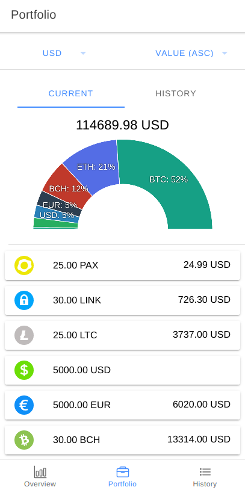
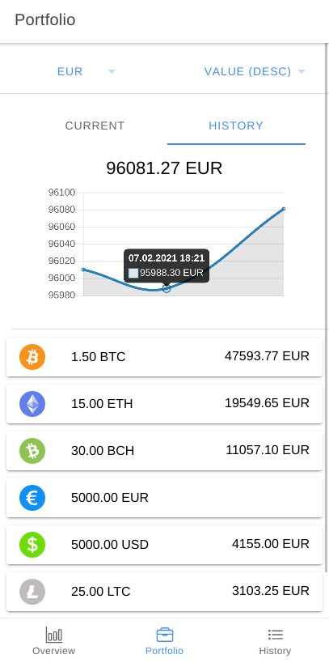
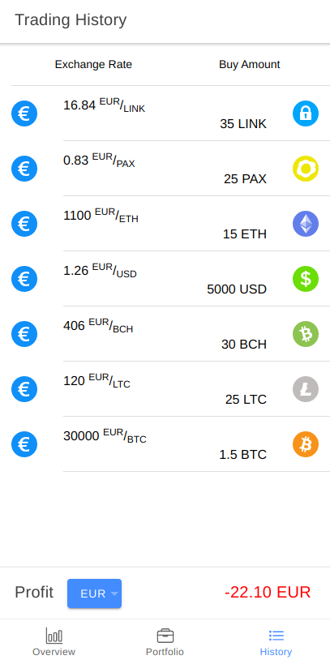

# Trading View

## Requirements
- `npm`
- `ionic`
- `cordova`
- `android sdk`
- `gradle`

## Structure
- `/schemas` contains `.ts` schemas and constant values
- `/ui` contains the actual project

## Start as PWA
`cd ui && npm install && npm start`
## Native Android
`cd ui && npm install && ionic cordova run android`

## Screenshots
 

